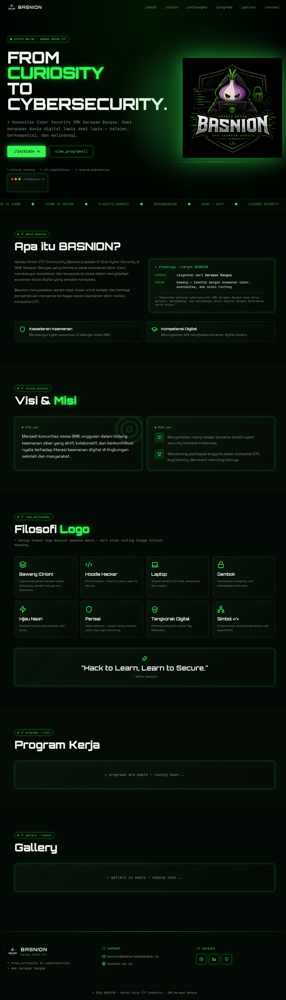

# 🧅 BASNION

> **Harbas Onion CTF Community** — Website resmi IT Club Cyber Security SMK Harapan Bangsa.

Website futuristik bertema cyberpunk/terminal untuk komunitas **Basnion**: tempat belajar, berkompetisi CTF, dan membangun kesadaran keamanan siber di kalangan siswa SMK.



---

## ✨ Fitur

- **Landing page dinamis** — Hero terminal, About, Visi & Misi, Filosofi Logo, Program Kerja, Gallery, Footer — semua konten bisa diedit dari dashboard admin.
- **Tema cyberpunk** — Neon green `#39FF14`, Matrix rain background, scanlines, JetBrains Mono + Orbitron.
- **Admin Dashboard** — CRUD Gallery, Programs, dan Site Content (hero, about, vision, philosophy, footer, sosmed).
- **Authentication** — Lovable Cloud Auth (Supabase) dengan role `admin` berbasis tabel `user_roles` (anti privilege escalation).
- **Obfuscated admin path** — Login admin di `/Hosu35Hioasss` (tidak tertulis di sitemap publik).
- **Dual database support** — Production via Lovable Cloud (Postgres). Mirror lokal via MySQL 8 untuk development.
- **Docker-ready** — `docker compose up -d` → app jalan di **http://localhost:3618**.

---

## 🧱 Tech Stack

| Layer       | Tech                                                                 |
| ----------- | -------------------------------------------------------------------- |
| Framework   | TanStack Start v1 (React 19 + SSR) + Vite 7                          |
| Styling     | Tailwind CSS v4 + shadcn/ui + design tokens via `oklch`              |
| Backend     | Lovable Cloud (Supabase) — Postgres + Auth + RLS                     |
| Local DB    | MySQL 8 (via Docker)                                                 |
| Runtime     | Bun 1.1                                                              |
| Deploy      | Docker / Vercel (lihat `docs/`)                                      |

---

## 🚀 Quick Start

### 1. Development (Lovable preview)
Buka project di Lovable, semua sudah otomatis — preview live update saat edit.

### 2. Local dev (di mesin sendiri)
```bash
bun install
bun run dev
# → http://localhost:5173
```

### 3. Production via Docker
```bash
docker compose up -d --build
# → http://localhost:3618
```

---

## 🔐 Admin Access

| Field    | Value                                  |
| -------- | -------------------------------------- |
| URL      | `/Hosu35Hioasss`                       |
| Email    | `jurikju31@harbas.onion.com`           |
| Password | _(disimpan aman di Lovable Cloud Auth)_ |

> Password awal di-seed sekali via migration. Setelah login pertama, ganti password dari dashboard backend Lovable Cloud. **JANGAN commit password ke repo publik.**

Dashboard menyediakan editor lengkap untuk:
- **Site Content** — Hero (badge, judul 3 baris, terminal lines), About, Vision & Misi, Filosofi Logo, Footer (kontak + sosmed).
- **Gallery** — Tambah/edit/hapus item gallery (judul, deskripsi, URL gambar, sort).
- **Programs** — Tambah/edit/hapus program kerja (judul, ikon, tanggal, deskripsi).

---

## 📁 Struktur Project

```
basnion/
├── src/
│   ├── routes/                    # File-based routing TanStack
│   │   ├── __root.tsx            # Root layout
│   │   ├── index.tsx             # Landing page
│   │   ├── Hosu35Hioasss.index.tsx       # Admin login
│   │   └── Hosu35Hioasss.dashboard.tsx   # Admin dashboard
│   ├── components/                # Navbar, Footer, MatrixRain, Terminal, ui/
│   ├── lib/site-content.ts        # CMS engine (merge default + override DB)
│   ├── integrations/supabase/     # Auto-generated Supabase clients
│   └── styles.css                 # Design tokens + animations
├── supabase/migrations/           # Database schema (Postgres)
├── scripts/
│   ├── setup-mysql.sh             # Setup MySQL lokal
│   └── mysql-init.sql             # Schema MySQL
├── docs/
│   ├── DOCKER.md                  # Cara deploy via Docker
│   ├── MYSQL.md                   # Setup database MySQL lokal
│   ├── VERCEL.md                  # Cara deploy ke Vercel
│   └── screenshot-landing.png
├── Dockerfile                     # Multi-stage build (BuildKit cache mounts)
├── docker-compose.yml             # Web :3618 + MySQL :3306
└── README.md
```

---

## 📚 Dokumentasi Deployment

- 🐳 **[Docker](docs/DOCKER.md)** — Run lokal/server, optimasi build, troubleshooting.
- 🐬 **[MySQL](docs/MYSQL.md)** — Setup database lokal pakai script bash.
- ▲ **[Vercel](docs/VERCEL.md)** — Deploy ke Vercel + env variables.

---

## 🎨 Design System

Color tokens dideklarasikan di `src/styles.css` pakai `oklch`. Variabel kunci:

| Token            | Hex equivalent | Pakai untuk           |
| ---------------- | -------------- | --------------------- |
| `--primary`      | `#39FF14`      | Neon green accent     |
| `--background`   | `#000000`      | Page background       |
| `--accent`       | `#A855F7`      | Onion purple highlight |
| `--foreground`   | `#E5E7EB`      | Body text             |

Font: **Orbitron** (display) + **JetBrains Mono** (body/terminal).

---

## 🤝 Kontribusi

Project ini dikelola oleh anggota Basnion SMK Harapan Bangsa.
Kontak: **basnion@smkharapanbangsa.id**

- Instagram: [@Basnion](https://instagram.com/Basnion)
- LinkedIn: [Harbas Onion](https://linkedin.com/company/harbas-onion)
- GitHub: [basnion](https://github.com/basnion)

---

## 📜 License

© 2026 BASNION · Harbas Onion CTF Community · SMK Harapan Bangsa
